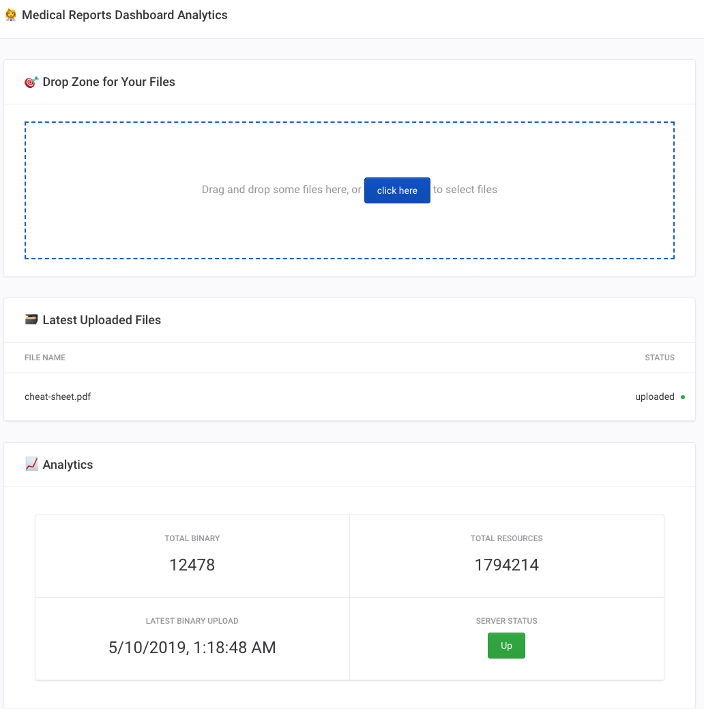

# NEFIL

> Medical reports dashboard analytics


## 🐣 Introduction

Very - _very very_ - first iteration of a web application connected to the [FHIR standard](https://www.hl7.org/fhir) that will upload a document and give some analytics to the user.

## 💻 [Live demo](https://nefil.now.sh/)



## 🏗️  Installation

```sh
❯ git clone git@github.com:92bondstreet/nefil.git
❯ make install
```

**Note:**

* Bootstrapped with [create-react-app 3.0.1](https://github.com/facebook/create-react-app/blob/master/CHANGELOG.md)
* Based on [React Hooks](https://reactjs.org/docs/hooks-intro.html) (at least React 16.8)
* [Yarn](https://yarnpkg.com) is the package manager
* [react-scripts](https://www.npmjs.com/package/react-scripts) is replaced by [rescripts](https://github.com/harrysolovay/rescripts) to allows us to customize the CRA setup without ejecting
* Update the `.webpack.config.js` with `electron-renderer` as [target](https://webpack.js.org/configuration/target/)

## 🕹️  Usage

```sh
## start local web application for dev purpose
❯ make sandbox

## start local desktop application for dev purpose
❯ make sandbox-desktop
```

## 📦 Distribution and Packaging

```sh
## build a ready-production web application
❯ make build

## build a ready-production desktop application
❯ make build-desktop
❯ make build-desktop -- -lm # for linux and mac
❯ make build-desktop [-- <args>] # where args is the electron-builder building commands: https://www.electron.build/cli
```

## 📱 Features

- [X] 🎯 Select file with a drop zone
- [X] 📡 Send files content as `Binary` to the [fhir API Server](https://fhirtest.uhn.ca/baseDstu3/Binary)
- [X] 📈 Get some analytics from [fhir Server](https://hapi.fhir.org/)
- [X] 📦 Pack a desktop application with [Electron](https://electronjs.org)
- [X] 📦 Watch a local directory

## 🚀 Deploy


```sh
❯ make deploy
```

## 🌱 Inspiration - deep dive reading

* [Lifen Frontend Challenge](https://github.com/honestica/frontend-jobs)
